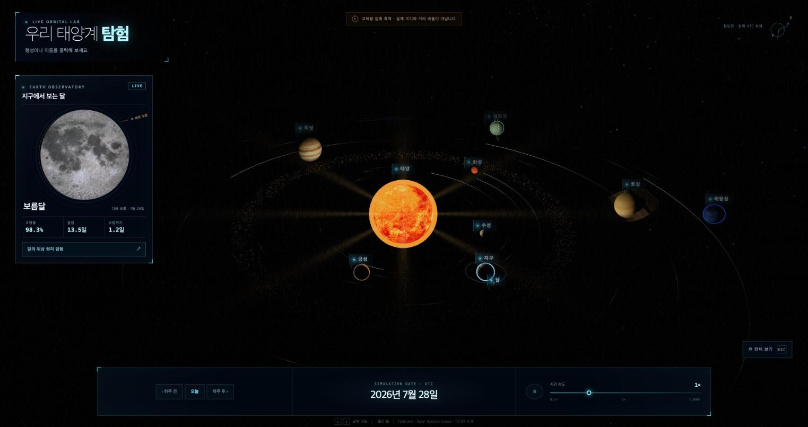
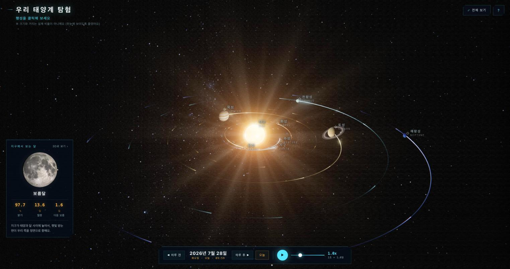
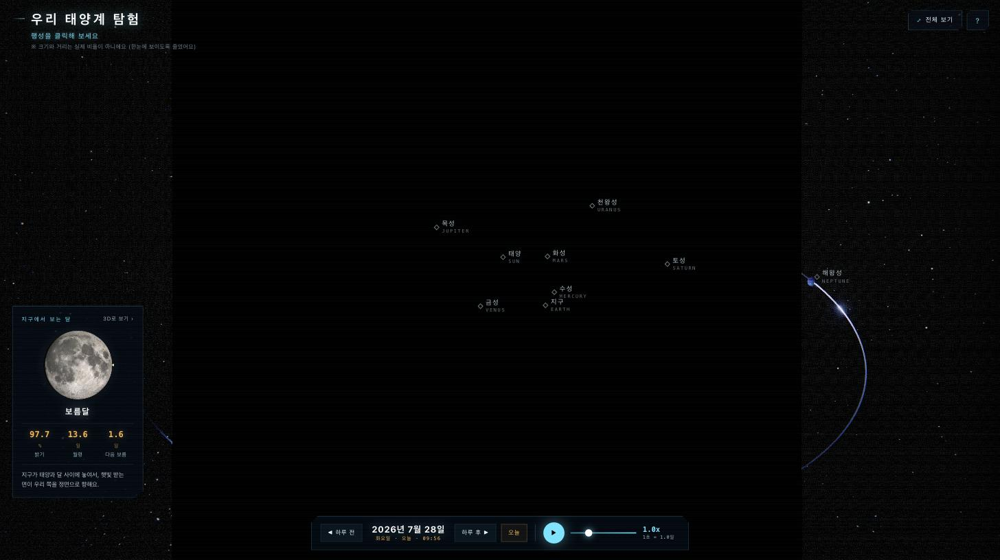
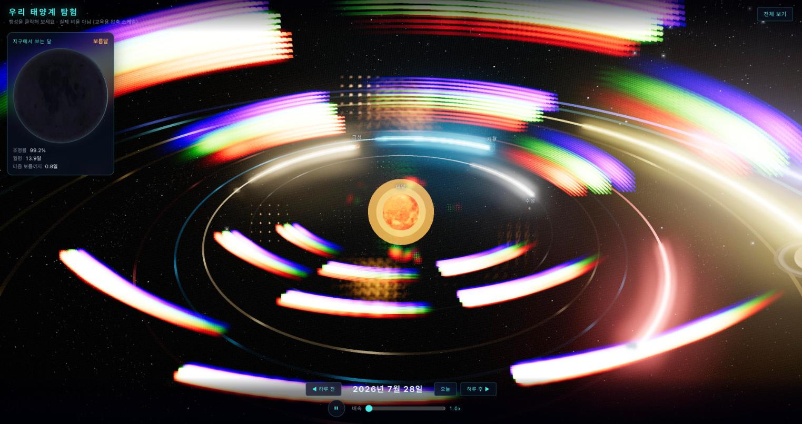

# 코딩 에이전트 벤치마크 — Space3D 태양계 시뮬레이터

동일한 스펙 하나를 세 개의 에이전트 CLI에 헤드리스로 시켜 만들게 하고,
소요 시간·토큰 사용량·크래시와 치명 버그·결과물 품질을 계측한 기록.

- **과제 ID**: `2026-07-27-space3d-moon`
- **실행**: 2026-07-27 16:44 ~ 19:28 (KST), **순차 실행** (동시 실행 없음 — 시간 측정 경합 배제)
- **격리**: 사용자 전역 설정 미적용 (claude `--safe-mode`, codex `--ignore-user-config`, grok `--no-memory`)
- **재시도 정책**: 완료(critical 체크 통과)까지 **같은 세션을 재개**, 최대 6회. 실패한 빌드 출력을 다음 시도 프롬프트로 되먹임
- **참가자**: 3

---

## 한 줄 결론

**gpt-5.6-sol이 이번 과제의 승자다.** 셋 중 유일하게 어떤 뷰포트에서도 스펙대로 렌더링되는
결과물을 냈고, 1회 시도로 끝냈다. opus 5는 코드 품질과 자체 검증이 가장 뛰어났지만
특정 창 크기에서 3D 씬이 통째로 사라지는 버그가 있고, grok 4.5는 가장 빨랐지만(10분)
스펙이 명시적으로 경고한 렌즈플레어 실패 모드에 그대로 빠졌다.

## 🚀 배포된 결과물

각 모델이 만든 앱을 직접 열어볼 수 있습니다.

| 모델 | 배포 URL | 상태 |
|---|---|---|
| `gpt-5.6-sol` | **https://space3d-sol.vercel.app** | ✅ 정상 |
| `claude-opus-5` | https://space3d-opus5.vercel.app | ⚠️ 창 높이에 따라 3D 씬 소실 (창을 세로로 키우면 정상) |
| `grok-4.5` | https://space3d-grok45.vercel.app | ⚠️ 렌즈플레어 고스트로 화면 대부분 가려짐 |

---

## 1. 종합 순위표

| # | 참가자 | 모델 | effort | 시간 | 시도 | 입력 | 출력 | 총 토큰 | 비용(API 환산) | 자동검증 | 시각검증 | 품질 |
|---|---|---|---|---|---|---|---|---|---|---|---|---|
| 🥇 | codex | `gpt-5.6-sol` | high | **26.8분** | 1 | 4,536,442 | 17,979 | 4,554,421 | N/A | 10/10 | ✅ 정상 | **43/50** |
| 🥈 | claude | `claude-opus-5` | high | 120.0분 | 2 | 156,824 | 89,441 | 32,150,726 | $25.52 | 10/10 | ❌ 조건부 파손 | 36/50 |
| 🥉 | grok | `grok-4.5` | high | **10.3분** | 1 | 156,283 | 5,842 | 1,039,396 | $0.73 | 10/10 | ❌ 파손 | 31/50 |

**주의 — 이 표에서 가장 중요한 사실**: 세 참가자 모두 자동 검증 **10/10 만점**이다.
빌드도 되고, 역법 자체 테스트도 통과하고, 프리뷰 서버도 200을 준다. 그런데 실제로
브라우저에서 열어보면 **둘은 망가져 있다.** 자동 검증만 믿었다면 셋 다 성공으로
기록됐을 것이다.

각주:
- 시간은 벽시계 누적. opus 5의 120분은 1차 60분(전부 API 장애로 소모) + 2차 60분이다. 아래 §5 참조.
- 총 토큰 산식은 CLI마다 다르다. codex는 `input(캐시 포함) + output`, claude/grok은 `input + cache_read + cache_write + output`. **`입력` 열을 CLI 간에 직접 비교하면 안 된다.**
- 비용은 실지출이 아니라 API 환산가다. 셋 다 구독 인증(claude.ai Max / ChatGPT Plus / grok.com)이라 **실제 추가 청구액은 0원**이고, 소모된 것은 구독 한도다. codex는 비용을 보고하지 않아 N/A.

---

## 2. 속도

| 참가자 | 실행 시간 | 시도 | 턴 수 | 분당 생산 코드 |
|---|---|---|---|---|
| grok-4.5 | **10.3분** | 1 | 17 | 493줄/분 |
| gpt-5.6-sol | 26.8분 | 1 | — | 156줄/분 |
| claude-opus-5 | 120.0분 | 2 | 153 | 69줄/분 |

grok이 압도적으로 빠르다. 다만 §4에서 보듯 그 속도가 품질을 대가로 얻어진 것인지는
구분해서 봐야 한다.

opus 5의 120분은 그대로 읽으면 오해가 된다. **1차 시도 60분은 코드를 쓴 시간이 아니라
HTTP 529(서버 과부하)를 6번 맞고 재시도하다 스트리밍이 끊긴 시간이다.** API가 회복된
뒤의 2차 시도는 17분 만에 1차 60분치를 넘어섰다. 장애를 제외한 실질 작업 시간은
30~40분대로 보는 것이 타당하다.

---

## 3. 토큰 효율

| 참가자 | 총 토큰 | 산출 코드 | 토큰/줄 |
|---|---|---|---|
| grok-4.5 | 1,039,396 | 5,078줄 | **205** |
| gpt-5.6-sol | 4,554,421 | 4,173줄 | 1,091 |
| claude-opus-5 | 32,150,726 | 8,293줄 | 3,877 |

opus 5가 grok의 **31배** 토큰을 썼다. 재시도 2회, 153턴, 자체 스크린샷 17장 촬영
및 후처리 ablation 테스트가 모두 여기 포함된다. 철저함의 대가다.

---

## 4. 정확성 — 크래시와 치명 버그

### 4.1 역법 정확도: 셋 다 동등하다

가장 어려운 기술 요소였는데 **변별력이 없었다.** 세 구현체를 직접 import 해
수치를 교차 비교한 결과:

```
행성 일심황경 (2000~2030, 30일 간격)
  수성/지구/목성/해왕성 — 세 구현 상호 최대편차 0.0000°

달 황경 상호 편차 (2000~2010, 3653일)
  최대 0.14°   ← 스펙 요구 0.5° 이내

삭망월 (망 통과 시각 이분법, 122회 측정, 이론값 29.530589일)
  sol 29.533670일 / opus5 29.533754일 / grok 29.533670일
  → 셋 다 오차 4.4~4.6분, 동일 수준
```

셋 모두 JPL J2000 궤도요소를 정확히 구현했다. 달은 opus 5와 grok이 Meeus Ch.47
완전 급수(89~120항), sol이 Schlyter 계열 축약(12항)을 썼지만 **교육용 정밀도에서는
차이가 드러나지 않았다.**

opus 5만 세차운동 보정(`precessionInLongitude`)을 적용해 J2000 좌표계로 환산한다.
다른 둘은 그날의 평균분점 기준이다. 둘 다 타당한 관례이고, 10년 구간에서 0.14°
차이의 원인이다.

### 4.2 시각 검증 — 여기서 갈렸다

같은 뷰포트, 같은 날짜, 같은 조건으로 세 앱을 브라우저에서 직접 열었다.

#### 🥇 gpt-5.6-sol — 정상



테스트한 두 뷰포트(1456×816, 1440×980) 모두에서 정상 렌더링. 달 인셋 패널에
**"태양 방향" 화살표 주석**까지 있다 — 스펙의 "왜 그 위상으로 보이는지" 요구를
가장 직접적으로 만족시킨 구현이다. 조명률 98.3%에 맞게 달이 거의 꽉 찬 원으로 보인다.

#### 🥈 claude-opus-5 — 뷰포트에 따라 3D 씬이 통째로 사라짐

정상 동작 (1440×980):


**파손 (1456×816) — 같은 빌드, 같은 코드:**


라벨과 UI는 그리는데 **태양·행성·궤도가 전부 사라진다.** 콘솔 에러는 없고,
JS는 정상 실행되며, 캔버스만 창 크기와 어긋나 있다. "전체 보기" 버튼을 눌러도
복구되지 않는다.

스펙 68행 "모바일에서도 동작 — 최소한 안 깨지게" 위반이다. 정상 동작할 때의
화면은 셋 중 가장 완성도가 높기에 더 아쉬운 결함이다.

#### 🥉 grok-4.5 — 스펙이 경고한 실패 모드에 그대로 빠짐



**버그 1 — 렌즈플레어 고스트 타일링.** 스펙 55·58행이 이 실패를 문자 그대로
예고했다:

> "fract 래핑 금지 — 화면 밖 소스는 클램프로 버릴 것, 안 그러면 화면 전체에 고스트 타일링됨"
> "threshold 를 너무 낮추면 궤도 빛 펄스가 전부 고스트로 번져 사이키델릭해짐"

결과물이 정확히 그 상태다. 무지개색 고스트 줄무늬가 화면 전체를 덮어 태양계가
거의 보이지 않는다. 로딩 직후만이 아니라 18초 후에도 그대로다.

**버그 2 — 달 패널 명암 반전.** 패널이 `보름달 / 조명률 99.2%`라고 표시하면서
달을 **거의 검은 원**으로 그린다. 99.2% 조명이면 꽉 찬 밝은 원이어야 한다.
핵심 교육 기능이 정확히 반대로 동작한다.

### 4.3 자동 검증이 놓친 것

| 체크 | sol | opus5 | grok | 실제 |
|---|---|---|---|---|
| `npm run build` | ✅ | ✅ | ✅ | 셋 다 진짜 통과 |
| `npm run selftest` | ✅ | ✅ | ✅ | 셋 다 진짜 통과 |
| `dist/` 생성 | ✅ | ✅ | ✅ | 셋 다 진짜 통과 |
| preview 200 응답 | ✅ | ✅ | ✅ | 셋 다 진짜 통과 |
| **실제로 보이는가** | ✅ | ❌ | ❌ | **자동 검증 불가** |

셸 명령으로 짤 수 있는 체크는 전부 통과했다. WebGL 렌더 결과는 픽셀을 봐야만
알 수 있고, 그게 이 벤치마크에서 순위를 결정했다.

---

## 5. 품질 심사 (블라인드)

벤더를 모르는 상태에서 A/B/C 라벨로 코드를 읽고 채점한 뒤 공개했다.
(A=gpt-5.6-sol, B=claude-opus-5, C=grok-4.5)

| 축 | sol | opus5 | grok | 근거 |
|---|---|---|---|---|
| 요구사항 충족도 | 9 | 9 | 8 | 셋 다 대부분 구현. grok만 CSS2DRenderer 미사용 |
| 정확성 | **9** | 5 | 4 | 역법은 동등. 렌더링에서 갈림 (§4.2) |
| 견고성 | **9** | 4 | 5 | sol만 두 뷰포트 모두 정상 |
| 코드 품질 | 8 | **9** | 8 | opus5가 `effects/` 분리, 632줄 역법에 세차보정까지 |
| 완성도 | 8 | **9** | 6 | opus5는 자체 스크린샷 17장 + ablation 테스트 |
| **합계** | **43** | **36** | **31** | |

### 참가자별 소견

**gpt-5.6-sol (43점)**
- 장점: 유일하게 실제로 동작한다. 3,242줄로 가장 간결하면서 기능은 다 들어있다. 달 패널의 "태양 방향" 주석은 스펙 의도를 가장 잘 읽은 부분.
- 단점: `style.css`가 1,270줄로 전체의 39%. 역법이 12항 축약이라 장기 정밀도는 셋 중 가장 낮다(교육용으론 무관). 자체 검증 흔적이 없다.

**claude-opus-5 (36점)**
- 장점: 코드 구조가 가장 좋다 — `src/effects/` 분리, `textures.js` 폴백 전용 모듈, 632줄 역법에 세차 보정. `scripts/selftest.mjs`가 364줄로 가장 촘촘하다. **스스로 브라우저를 띄워 17장을 촬영하고 후처리 on/off ablation까지 돌렸다** — 셋 중 유일하게 자기 결과물을 눈으로 확인했다.
- 단점: 그렇게 확인하고도 뷰포트 의존 버그를 놓쳤다. 자기가 쓴 창 크기(1440×900)에서만 봤기 때문이다. 토큰을 31배 썼다.

**grok-4.5 (31점)**
- 장점: 10.3분/17턴은 압도적이다. 토큰/줄 205로 효율도 최고. 역법 구현은 Meeus 완전 급수로 셋 중 가장 정밀한 축에 든다.
- 단점: 스펙이 두 곳에서 명시적으로 경고한 렌즈플레어 함정에 그대로 빠졌다. 달 패널이 조명률과 반대로 그려진다. **속도의 대가가 품질이었다.**

---

## 6. 방법론과 한계

### 실행 조건
- 프롬프트: [`PROMPT.md`](PROMPT.md) (스펙 [`SPEC.md`](SPEC.md) 전문 포함)
- CLI 버전: claude 2.1.220 / codex 0.145.0 / grok 0.2.112
- effort는 세 CLI 모두 `high`. 일부러 잘못된 값을 넣어 거부 메시지로 유효값을 역확인했다.
- 인증: 전부 구독 (claude.ai Max / ChatGPT Plus / grok.com). API 키 아님.
- 순차 실행이라 CPU·대역폭 경합은 없다.

### 반드시 감안할 것

1. **표본은 1이다.** 이 과제 1회 실행 결과이고, 벤더 간 일반적 우열로 확대 해석하면 안 된다.
2. **opus 5는 인프라 장애를 정면으로 맞았다.** 1차 시도가 HTTP 529 6회로 통째로 날아갔다. 같은 시각 codex와 grok은 영향이 없었다. 시간·토큰 지표가 이 때문에 불리하게 잡혔다.
3. **격리가 비대칭이다.** claude/codex/grok 모두 전역 설정을 껐지만 수단이 각각 다르다(`--safe-mode` / `--ignore-user-config` / `--no-memory`). grok의 격리가 가장 약하다.
4. **시각 평가는 두 뷰포트만 봤다.** 모바일 실기기, 다양한 GPU에서의 동작은 확인하지 않았다.
5. **품질 점수는 Claude가 매겼다.** 블라인드로 진행했지만 자사 모델이 포함된 평가라는 점을 감안해야 한다. 정확성·견고성 점수는 스크린샷이라는 객관 증거에 근거하지만, 코드 품질 점수는 주관이다.
6. **Google Antigravity(gemini)는 불참.** 토큰 사용량을 전혀 보고하지 않아 4대 지표 중 하나를 채울 수 없어 제외했다.

### 산출물 위치
```
opus5/   claude-opus-5 결과물
sol/     gpt-5.6-sol 결과물
grok45/  grok-4.5 결과물
docs/screenshots/   시각 검증 증거
```

원본 계측 데이터는 벤치마크 실행 디렉토리의 `summary.json`, 참가자별
`metrics.json`(시도별 내역 포함), `verify.json`에 있다.
